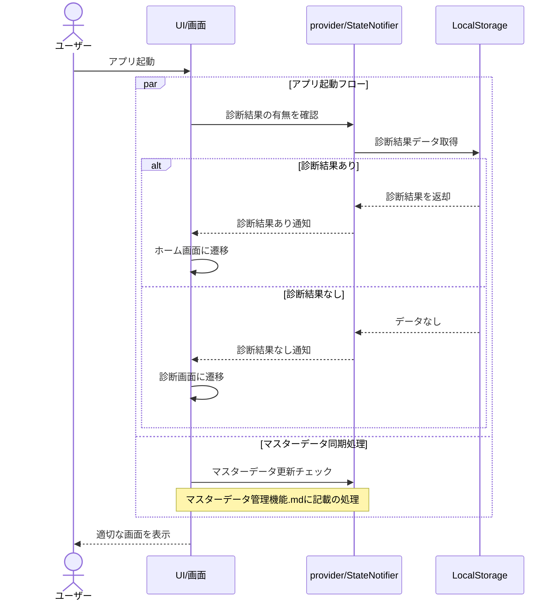

# 俺の最強AI駆動開発手順


## 📖 この手順書について

現時点で最適だと思っている開発手順を説明するよ。

ふーん、こんな感じでやってんのね。って感じで見てください。

みんなも自分の「俺の」「私の」最強AI駆動開発手順を作ってくれよな!


## 💡一番大事なこと

個人開発で一番大事なのはモチベーション管理です。

一発当てるために個人開発してるので、今のところモチベ保ち続けられてれます。

一番最初は学習目的でアプリを作りながら勉強したこともありましたが、学びたい技術の技術熟練度みたいなのがわかりずらいのでモチベーションが落ちるのと、学習目的でアプリを完成させるのが結構しんどくてやめたくなりましたね。やめましたね。

次の個人開発は、試験勉強とか得意じゃないので、作りたいものベースで個人開発しました。これはうまく行きましたね。
自分の中での最適解は、『作りたいもの』＋『学びたい新技術』です。

なので以下を基準に考えるといいかと。

1. 試験勉強とか、ザ！勉強が得意
　→何やってもいける

1. 1に苦手意識がある
　→作りたいものベースじゃないときついかも

**重要**: 最初のうちは自分の得意なこと以外はやりすぎない。やらないくらいがちょうどいい。例えば、Javaが得意な人はフロントエンドのベストプラクティスがReactなどだとしても、やっちゃダメ。JavaでHTMLを書くやつでやる。それに慣れていないならCLIでやるべき。
もちろんフロントエンド言語を学ぶことが目的である場合は別ですが。


## 🚀 開発フロー概要j

```
💡 アイデア/学習目標
    ↓
📋 企画・要件整理
    ↓
🎨 設計
    ↓
💻 実装
    ↓
🔧 改善
    ↓
🎯 完成・振り返り
    ↓
📈 次プロジェクトへ
```

**重要**: 各段階で完璧を求めず、**動くものを早く作る**ことを最優先（完璧主義ダメ絶対）


## 💡 Phase 0: プロジェクト決定

- アプリアイデアを考える。
- 使用する技術を考える。
- これくらいで最初のリリースしたいなを考える。

**重要**: なんとなくで次に進む。自分で作っていてもアプリの要件というか、こうしたいは変化することが多いので作りながら柔軟に変えていって、正解に近づけていけば良い。


## 📋 Phase 1: 企画・要件整理

- なる早で要件まとめる。

**重要**: けどなんとなくでは次に進みたくない。理由は、手戻りをなるべくしたくないからと、ここでその時の最適解をしっかり決めておかないと設計が思うように進まない。

### 🎯 成果物
- 簡単な要件定義書
- 開発期間・スケジュール。（次からは決める。今までなんとなく3ヶ月でリリースしようと思ってたけど実現できたことない。）

### 📝 要件定義書　直近のアプリのやつ

色々AIと相談しながら作成。アイデア自体は自分の中にあるので、基本的に壁打ち相手になってもらう。

<details>
  <summary>要件定義書例</summary>

``` markdown
#　シンプルPRD(プロダクト要求仕様書)

# どんなアプリ？

<aside>
🔥

15分で重要な悩みを解決できる、決断サポートアプリ

</aside>

---

# 背景

<aside>
🏞️

多くの人が漠然とした悩みを抱えている一方で、それを他人に相談するのが難しいと感じていることが多いと考えています。相談したい内容があっても、相手にどう伝えれば良いのかがわからない、または自分の気持や悩みを正確に理解してもらえないのではないかと不安に思ってしまうことがあります。
さらに、質問を受けた側も、相手の状況や価値観を十分に理解できないまま、自分の範囲で答えるしかなく適切なアドバイスをするのが難しいという問題があります。悩みを解決するためには、悩みを伝えるスキルと、相手に適切な答えを返すスキルの両方が求められますが、これらのスキルが不足していると、悩みは解消されず、悩みを一人で抱え込んでしまう可能性があります。

</aside>

---

# 問題

<aside>
💡

年齢や人生のフェーズによって悩みは異なりますが、身近に相談できる人がいない、または同じような境遇の人が周囲にいない場合、悩みを一人で抱え込みがちです。こうした場合、悩みを解決するための具体的なアクションを取れず、堂々巡りに陥ってしまうことが多くなります。悩みが解決しないまま時間が経過すると、自己嫌悪に繋がり、前向きに進む力が失われます。その結果、悩みだけではなく、仕事や人間関係などの他の面でも良い結果を出せなくなり、生活全体に悪影響を与える原因となってしまいます。

</aside>

---

# 目的とゴール

<aside>
⛳

本アプリの目的は、ユーザーが自分の価値観を元に悩みに向き合い、前向きに進むための一歩を踏み出す手助けをすることです。ユーザーが自分の価値観に基づいて悩みを再確認し、前に進むためのヒントを得られることをゴールとします。

</aside>

- 価値観診断: ユーザーが自分の価値観を明確にし、自己理解を深める。
- AIとの会話: ユーザーが自分の価値観に沿ったアドバイスを受け、悩みを前向きに解決する方向に導く。

---

# 成功基準

<aside>
❤️‍🔥

プロジェクトの成功を測るために、以下の基準を設定します:

</aside>

- ユーザー満足度: アプリストアの星4以上
- ユーザー数: アプリの登録ユーザー数が1,000人を突破する。

---

# 主要な機能およびスコープ

<aside>
⭐ 本プロダクトは、自己理解と悩み解決を支援するシンプルで効果的なツールを目指します。以下の機能を提供し、これら以外の機能については現時点では対象外とします。

</aside>

## 機能1: 価値観診断機能

### 概要：

ユーザーが自分の価値観を診断し、診断結果を受け取る機能です。この診断を通じて、自分自身の価値観が明確になり、悩みに向き合うための基盤を作ります。

### ゴール：

ユーザーが価値観を明確にし、その結果を基に悩みや今後の行動に新たな視点を得ること。

### ユースケース：

- ユーザーが48項目の価値観診断に回答する。
- 各項目について5段階評価で選択し、自分が最も重視する価値観を5つ選ぶ。
- 診断結果として、上位5つの価値観を表示し、その解説を提供する。

---

```

</details>

---

## 🎨 Phase 2: 設計

Claudeでやることが多い。
設計書が多くなってきて、プロジェクトナレッジでの管理がめんどくさくなってきたらClaude Codeを使うのもあり。

画面設計はClaudeでやるのが好み。

データ設計もClaudeでやるのが好み。

機能設計はシーケンス図で理解したいので、設計書の数が多くなってきたらClaude Codeでシーケン図の登場人物を合わせてもらったりする。基本Claude。

### 🎯 成果物
- 画面設計（なんとなく全体のデザインの感じを作れたらOK）
- データ設計
- 機能設計


### 画面設計

- 各画面で何をやりたいのかをまとめる
- アプリのデザインをどんな風にするかを決める。参考サイトとか、色々見たり、AIにそれっぽいの作成してとか言ってみたりする。
- デザインをもとに、作成したい画面を作成していく。

<details>
  <summary>アプリのLP作成例</summary>

https://claude.ai/share/fe9d1ca5-9142-4684-9ccd-589d4fa3c63a
上記を参考にLPを作成。


```
以下のYAML仕様に従って、It's MeアプリのランディングページをHTML/CSS/JavaScriptで作成してください:

project:
  name: "It's Me App Landing Page"
  concept: "Values assessment × AI advisor app to help users take positive steps forward"
  target_audience: "Men and women aged 20-40 who have vague concerns but no one nearby to consult"

design_要件定義書:
  color_palette:
    primary: 
      - "#E8F4F8" # Light blue
      - "#F0E8FF" # Light purple
    description: "Gradient from light blue to light purple"
    accent:
      - "#8B7EC8" # Warm purple
      - "#7EC8E3" # Gentle blue
    secondary:
      - "#FFB366" # Warm orange
      - "#FFCCCB" # Light pink
    text:
      - "#333333" # Dark grey
      - "#666666" # Medium grey
  
  style:
    overall_impression: "Calm, gentle, stylish, approachable"
    ui_elements: "Rounded card-type design, soft drop shadows"
    illustrations: "Cute animal characters (Dog, Turtle, Peacock, Leopard, etc.) as icons"
    typography: "Modern, readable fonts with appropriate line spacing"

technical_specifications:
  implementation:
    framework: "HTML5 + CSS3 + JavaScript (vanilla or framework of choice)"
    responsive: "Mobile-first design, beautiful display on desktop"
    animations: "Subtle and elegant CSS transitions"
    compatibility: "Modern browser support (Chrome, Firefox, Safari, Edge)"
  
  performance:
    page_load_time: "Within 3 seconds"
    image_optimization: "WebP format recommended, appropriate compression"
    animations: "60FPS, battery consumption consideration"

page_structure:
  header:
    layout: "Fixed header, 80% transparent background"
    elements:
      - "Top left: It's Me logo (icon + text)"
      - "Top right: Language switcher (🇯🇵 🇺🇸 🇰🇷 🇪🇸) + Download button"
    style: "Minimal design, background darkens on scroll"

  hero_section:
    headline: |
      Discover Your Values and
      Take a Positive Step Forward
    subheadline: |
      Discover your true self through 48 questions. 
      AI advisor finds answers just for you.
    visual_elements:
      background: "Beautiful gradient (blue → light purple)"
      center: "Smartphone mockup displaying app's diagnostic result screen"
      surroundings: "Floating animal icons (animated)"
    cta:
      primary: "Start Free Assessment"
      secondary: "Download App"
      stores: ["App Store", "Google Play"]
    layout: "Center-aligned, vertically stacked layout"

  assessment_explanation:
    headline: "Understand Your Unique Values in 3 Steps"
    steps:
      - title: "Answer 48 Questions"
        icon: "💭"
        description: "Tell us what matters to you on a 5-point scale"
      - title: "Discover Your Type"
        icon: "🔍"
        description: "Find the perfect character from 12 value types"
      - title: "Consult AI Advisor"
        icon: "🤖"
        description: "Receive personalized advice based on your values"
    style: "3-column layout (vertical stack on mobile), hover effects on cards"

  result_examples:
    headline: "Which Type Are You?"
    character_cards:
      - name: "Dog"
        category: "Relationships and Community"
        image: "Cute dog illustration"
        description: "Warm-hearted person who values human connections"
        color: "Warm orange tones"
      - name: "Turtle"
        category: "Health and Stability"
        image: "Peaceful turtle illustration"
        description: "Steady person who seeks stable life"
        color: "Calm green tones"
      - name: "Peacock"
        category: "Beauty and Creation"
        image: "Beautiful peacock illustration"
        description: "Artistic person who pursues beauty and creativity"
        color: "Elegant purple tones"
      - name: "Leopard"
        category: "Challenge and Adventure"
        image: "Cool leopard illustration"
        description: "Adventurous person who enjoys new challenges"
        color: "Energetic yellow tones"
    style: "2x2 grid (2x2 mobile, 4x1 desktop)"
    interaction: "Popup with detailed info on hover"

  user_testimonials:
    headline: "User Voices"
    testimonials:
      - quote: "My values became clear and I was able to make the decision to change jobs"
        profile: "28 years old, office worker"
        type: "Challenge and Adventure type"
      - quote: "The AI advisor's words saved me. I feel like I'm not alone"
        profile: "34 years old, housewife"
        type: "Relationships and Community type"
      - quote: "When I shared my results, it sparked great conversations with friends!"
        profile: "25 years old, student"
        type: "Beauty and Creation type"
    style: "Carousel format with auto-slide functionality"

  features_section:
    headline: "It's Me Features"
    features:
      - title: "Values Assessment"
        icon: "📊"
        description: "Discover your true self through 48 questions"
        details: "Scientifically-based assessment classifies your values into 12 types"
      - title: "AI Advisor"
        icon: "🤖"
        description: "Your personal coach"
        details: "24/7 customized advice based on your values"
        badge: "In Development"
      - title: "Result Sharing"
        icon: "📱"
        description: "Share results on social media"
        details: "Share assessment results on SNS with beautiful card design"
    style: "3-column layout with icon animations"

  download_section:
    headline: "Start Now"
    subheadline: "Experience values assessment for free"
    cta:
      - "App Store button (iOS)"
      - "Google Play button (Android)"
      - "Start Web Assessment button"
    background: "Soft gradient"
    qr_code: "For app download (hidden on mobile)"

  footer:
    elements:
      - "It's Me logo"
      - "Navigation links (Privacy Policy, Terms of Service, Contact)"
      - "Social media icons"
      - "Copyright notice"
    style: "Simple, minimal"

responsive_要件定義書:
  mobile:
    breakpoint: "320px-768px"
    layout: "1-column layout"
    touch: "Touch-optimized button sizes (44px+)"
    carousel: "Swipe-enabled carousel"
    optimization: "Vertical scroll optimization"
  
  tablet:
    breakpoint: "768px-1024px"
    layout: "2-column layout"
    spacing: "Appropriate margins and padding"
    touch: "Touch operation support"
  
  desktop:
    breakpoint: "1024px+"
    max_width: "1200px"
    interactions: "Hover effects and interactions"
    optimization: "Mouse operation optimization"

interactions_animations:
  micro_interactions:
    button_hover: |
      .btn-primary:hover {
        transform: translateY(-2px);
        box-shadow: 0 8px 25px rgba(139, 126, 200, 0.3);
        transition: all 0.3s ease;
      }
    card_hover: |
      .character-card:hover {
        transform: scale(1.05);
        transition: transform 0.3s ease;
      }
    floating_animation: |
      .floating-icon {
        animation: float 6s ease-in-out infinite;
      }
      @keyframes float {
        0%, 100% { transform: translateY(0px); }
        50% { transform: translateY(-20px); }
      }
  
  scroll_animations:
    - "Use Intersection Observer API"
    - "Fade-in effect when elements enter viewport"
    - "Subtle parallax effects based on scroll progress"

performance_metrics:
  tracking_elements:
    - "Google Analytics / GA4 implementation"
    - "Heatmap tool (Hotjar etc.) preparation"
    - "CTA button click tracking"
    - "Scroll depth measurement"

implementation_instructions:
  development_order:
    - "Create HTML structure"
    - "Implement basic CSS styles"
    - "Adjust responsive design"
    - "Add JavaScript interactions"
    - "Performance optimization"
    - "Cross-browser testing"
  
  file_structure: |
    index.html
    assets/
      ├── css/
      │   ├── style.css
      │   └── responsive.css
      ├── js/
      │   ├── main.js
      │   └── animations.js
      ├── images/
      │   ├── characters/
      │   ├── icons/
      │   └── backgrounds/
      └── fonts/
  
  semantic_html:
    - "Use appropriate HTML5 semantic elements"
    - "Consider accessibility (aria-label, alt attributes, etc.)"
    - "SEO optimization (meta tags, structured data)"

final_checklist:
  - "All sections properly implemented"
  - "Responsive design functioning"
  - "Loading speed within 3 seconds"
  - "All CTA buttons functional"
  - "Cross-browser compatibility"
  - "Accessibility standards met"
  - "Basic SEO setup completed"

objective: |
  Create a high-quality, beautiful landing page for the It's Me app following this specification. 
  Make it an attractive page that sparks user interest in values assessment and leads to app downloads.
```

</details>

## データ設計

AI任せで作る。

**データ設計プロンプト例**:

これで雛形を作るイメージ。

```
要件定義書.md の機能に必要なデータ設計をしてください：

【要件】
[要件定義書.mdの内容]

【技術】
[選択したDB技術]

【出力】
1. 必要なデータ一覧
2. データ構造（テーブル設計/ドキュメント設計）
3. CREATE文またはスキーマ定義
4. サンプルデータ

個人開発レベルでシンプルに設計してください。
```


## 機能設計

MVPの機能設計をする。大前提MVP以外は後回し。
シーケンス図で処理の流れをまとめることが多い。

<details>
  <summary>機能設計の例</summary>

# アプリ起動フロー設計

# 概要

アプリ起動時、ユーザーにシームレスな体験を提供するために、診断結果の有無に基づいて適切な画面に遷移する機能を実装します。この設計は、マスターデータの同期処理とは独立して動作し、並行して処理されます。


# フロー図




# アプリ起動フロー詳細

## スプラッシュ画面表示

- ユーザーがアプリを起動するとUI/画面がスプラッシュ画面を表示
- providerに診断結果の有無を確認するよう要求
- 同時に別プロセスでマスターデータの更新チェックを開始

## 診断結果の確認

- providerがLocalStorageから診断結果データを検索
- LocalStorageが診断結果の有無を確認し、providerに結果を返却

## 画面遷移判断

- 診断結果あり → providerからUIに通知し、ホーム画面に遷移
    - ホーム画面：診断結果サマリー、AIアドバイザー相談、詳細表示、シェア機能へのアクセスを提供
- 診断結果なし → providerからUIに通知し、診断画面に遷移
    - 診断画面：ユーザーに診断を促す導入と診断開始ボタンを表示


# マスターデータ同期との関係

## 並行処理

- アプリ起動フローとマスターデータ同期処理は並行して実行
- マスターデータ同期処理はマスターデータ管理機能.mdに記載の処理に従う
- 画面遷移はマスターデータ同期処理の完了を待たずに行われる

## 処理の独立性

- 診断結果の確認処理とマスターデータ同期は相互に依存しない
- マスターデータ同期に失敗しても、アプリ起動フローは継続される


# 考慮すべき点

## オフライン対応

- ネットワーク接続がない場合でも、LocalStorageのデータを使用して画面遷移できる設計
- 初回起動時のデフォルトデータの扱いについて検討

## パフォーマンスと体験

- 起動フローは最小限の処理のみを行い、素早く画面遷移を実現
- マスターデータの同期処理はバックグラウンドで実行し、UIブロッキングを防止

## エラーハンドリング

- LocalStorageアクセスエラーに対するフォールバック処理
- データ不整合が発生した場合の回復処理


# 画面遷移後の動作

## ホーム画面（診断結果あり）

- 診断結果サマリーの表示
- AIアドバイザーへの相談機能
- 診断結果詳細表示機能
- 診断結果シェア機能

## 診断画面（診断結果なし）

- 価値観診断の導入説明
- 診断開始ボタン
- 診断完了後にホーム画面へ自動遷移

</details>


## 💻 Phase 3: 実装

ここからClaude Codeで開発していく。

### 🎯 実装戦略

#### 📁 プロジェクト構成
```
project/
├── document/
│   ├── 01_要件定義/
│   ├── 02_基本設計/
│   └── 03_DB設計
├── src/
├── README.md
├── CLAUDE.md
└── .gitignore
```

#### 🚀 開発順序
1. **環境構築**
2. **CLAUDE.mdの作成&作り込み**
    <details>
      <summary>CLAUDE.mdに必須で入れたい</summary>

    ```
    ## 🎯 プロジェクト基本情報
    ・プロジェクト名・概要（1-2行）
    ・技術スタック（フロント・バック・DB）
    ・ディレクトリ構造

    ## 📁 設計書の場所
    ・document/配下のファイル一覧と各ファイルの役割

    ## 📋 Issue テンプレート

    ### 🎯 実装する機能
    [document/○○.md の ○○機能]

    ### 📚 参考資料
    - 設計書: document/○○.md
    - 関連Issue: #○○（あれば）

    ### 🔧 実装内容
    - [ ] [具体的な実装タスク1]
    - [ ] [具体的な実装タスク2]
    - [ ] [具体的な実装タスク3]

    ### ✅ 完了条件
    - [ ] 機能が正常に動作する
    - [ ] 設計書通りに実装されている
    - [ ] 既存機能に影響がない
    - [ ] 動作確認用のスクリーンショットを取得

    ### 🔍 動作確認方法
    1. [確認手順1]
    2. [確認手順2]
    3. [期待される結果]

    ### 💡 実装のポイント
    - [技術的な注意点]
    - [参考になるコード例]

    ## 🌿 ブランチ戦略

    ### ブランチ構成
    - **main**: リリース済みコード（常に動作する状態）
    - **develop**: 開発中のコード統合ブランチ
    - **feature/[機能名]**: 各機能の実装ブランチ

    ### ブランチ命名規則
    - **feature/[機能名]**: `feature/user-authentication`
    - **bugfix/[修正内容]**: `bugfix/login-error`
    - **hotfix/[緊急修正]**: `hotfix/security-patch`

    ### 作業フロー
    1. **developブランチから新機能ブランチを作成**
      git checkout develop
      git checkout -b feature/[機能名]
    2. 実装・コミット
      git add .
      git commit -m "feat: [機能名]を実装"
    3. developにマージ
      ・PRを作成
      ・レビュー・動作確認
      ・マージ
    4. リリース時にmainにマージ
      git checkout main
      git merge develop
      git tag v1.0.0

    コミットメッセージ規則
      feat: 新機能追加
      fix: バグ修正
      docs: ドキュメント更新
      style: コードスタイル修正
      test: テスト追加・修正


    ## 🔄 PR テンプレート

    ### 📋 概要
    [このPRで何を実装したか 1-2行で説明]

    ### 🎯 関連Issue
    Closes #[Issue番号]

    ### 🔧 実装内容
    - [実装した機能・修正内容1]
    - [実装した機能・修正内容2]
    - [実装した機能・修正内容3]

    ### 📚 参考資料
    - 設計書: document/○○.md
    - 関連PR: #○○（あれば）

    ### ✅ 動作確認
    #### 確認環境
    - OS: [Windows/Mac/Linux]
    - ブラウザ: [Chrome/Firefox/Safari]
    - デバイス: [PC/スマホ/タブレット]

    #### 確認結果
    - [ ] 新機能が正常に動作する
    - [ ] 既存機能に影響がない
    - [ ] エラーが発生しない
    - [ ] レスポンシブ対応済み（フロントエンドの場合）

    ### 📸 スクリーンショット・動画
    #### 実装前
    [実装前の画面キャプチャ]

    #### 実装後
    [実装後の画面キャプチャ]

    #### 動作確認
    [動作している様子の動画・GIF]

    ### 🚨 注意点・既知の問題
    - [レビュー時に注意してほしいポイント]
    - [既知の問題や制限事項]

    ### 📝 レビュー依頼
    - [ ] コードレビュー
    - [ ] 動作確認
    - [ ] 設計書との整合性確認

    ### 🔄 マージ後のアクション
    - [ ] developブランチに正常にマージされた
    - [ ] 動作確認環境での最終確認
    - [ ] 関連Issueのクローズ

    ```

</details>

4. **Claude Codeに設計書をもとに作りたい機能のIssuesにまとめてもらう**
- 例えば、アプリ起動フロー設計の機能が作りたいとして、Claude Codeに以下のように伝える。Githubとの連携は必須
```
document/アプリ起動フロー設計.mdをもとに実装手順を調査して、Issuesにまとめて。
```
- 上記でIssuesをまとめてもらったらレビューして、それでよければ進めて、イマイチだったら修正を繰り返す。
1. **Issuesの手順で実装を進める**
- Issuesが完成したら、このIssuesの作業ブランチを作成してとClaude Codeに依頼してブランチを切る。ここまでではまだソースコードは何も書いていない状態。Claudeが勝手に作業を始めたら止める。
- Issuesの手順通りに実装を依頼する。
1. **実装完了**
- 実装が完了したら動作確認。
- OKだったら、PRを作成してとClaude Codeに依頼をする。
- PRをレビューしてOKだったらマージ。
1. **リリーススコープのすべての機能が終わるまで『3〜6を繰り返す』**
2. **リリース**

### 💡 実装のコツ

#### ✅ 成功パターン
- **Claudeに正しい情報を渡す。**：AIに質の良いプロンプトを渡すために、まずは設計、次に設計をもとにどのように進めるかをIssuesで管理、それをもとに実装。という流れで行うのがベスト！
- **小さく動かす**：1つの機能ずつ完成させる
- **コミット細かく**：動作確認のたびにコミット
- **AI積極活用**：わからないことは即座に質問
- **動作優先**：完璧なコードより動くコード

#### ❌ 失敗パターン
- 最初から全機能を実装しようとする
- エラーを放置して先に進む
- 設計通りに作ろうと固執する
- コードの美しさにこだわりすぎる


## 🔧 Phase 4: 改善・デプロイ

改善はAIの大得意分野なのでいっぱい改善してもらいましょう。

### 🎯 成果物
- デプロイ済みアプリケーション
- README.md完成版

### 🚀 デプロイ戦略

#### 推奨サービス（無料枠活用）
| 用途 | サービス | 特徴 |
|-----|---------|------|
| **静的サイト** | Netlify | 簡単デプロイ、独自ドメイン |
| **フルスタック** | 知りません。 | DB込みで無料枠 |
| **フロントのみ** | GitHub Pages | Gitと連携 |

以上！